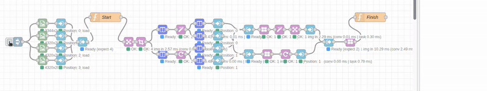

# Node-RED Image Processing Toolkit

A comprehensive Node-RED package for high-performance image processing operations using OpenCV backend. This toolkit provides 11 specialized nodes for loading, transforming, combining, and managing images in Node-RED flows.



## Overview

This Node-RED image processing toolkit consists of two main components:

1. **node-red-contrib-rosepetal-image-tools**: Node-RED package with image processing nodes
2. **rosepetal-image-engine**: C++ addon built with OpenCV for high-performance image operations

The project provides Node-RED nodes for image processing operations including resize, rotate, crop, concat, padding, filtering, and mosaic creation with support for both single images and batch processing.

## Architecture

### Two-Tier Structure
- **JavaScript Layer**: Node-RED nodes handle configuration, validation, and I/O
- **C++ Layer**: High-performance OpenCV-based image processing via Node.js addon

### Performance Benefits
- **C++ Backend**: All image operations use optimized OpenCV functions
- **Async Operations**: Non-blocking processing with performance timing
- **Parallel Processing**: Array inputs processed concurrently
- **Memory Efficient**: Optimized for large image processing workflows

## Installation

### Quick Setup
```bash
# From project root
./install.sh
```

### Manual Installation
```bash
# Install and build C++ engine
cd rosepetal-image-engine
npm install
npm run build

# Install Node-RED package
cd ../node-red-contrib-rosepetal-image-tools
npm install

# Install in Node-RED
cd ~/.node-red
npm install /path/to/node-red-contrib-rosepetal-image-tools
```

### System Requirements
- Node.js 16+ with node-gyp support
- OpenCV 4.x (detected via pkg-config)
- C++ compiler with C++17 support

## Node Categories

### 🔄 I/O Nodes (Data Flow Management)
- **image-in**: Load images from filesystem
- **array-in**: Collect data into positioned arrays
- **array-out**: Assemble arrays from multiple sources
- **array-select**: Extract elements from arrays with flexible selection

### 🔧 Transform Nodes (Image Processing)
- **resize**: Scale images with aspect ratio control
- **rotate**: Rotate images with custom padding
- **crop**: Extract regions with normalized/pixel coordinates
- **padding**: Add margins with configurable colors
- **filter**: Apply image filters (blur, sharpen, edge, emboss, gaussian)

### 🎨 Mix Nodes (Image Composition)
- **concat**: Combine images horizontally/vertically
- **mosaic**: Create grid layouts with positioned images

## Image Data Format

### Standard Format
Images are passed as objects using the current structure:
```javascript
{
  data: Buffer,        // Raw pixel data or file buffer
  width: number,       // Image width in pixels
  height: number,      // Image height in pixels
  channels: number,    // Channel count (1, 3, 4)
  colorSpace: string,  // "GRAY", "RGB", "RGBA", "BGR", "BGRA"
  dtype: string        // "uint8", "uint16", "float32"
}
```

### Legacy Format Support
The system maintains backward compatibility:
```javascript
{
  data: Buffer,
  width: number,
  height: number,
  channels: string     // e.g., "int8_RGB", "int8_RGBA", "int8_GRAY"
}
```

### File Format Support
- **Input**: JPEG, PNG, WebP, BMP files automatically detected and decoded
- **Output**: Raw image objects or encoded file buffers (JPEG, PNG, WebP)

## Common Workflows

### Computer Vision Workflow Example


*Real-time object detection pipeline with cropBB node extracting bounding box crops*

### Basic Image Processing Pipeline
```
image-in → resize → rotate → crop → [output]
```
**Use Case**: Load image, resize to standard dimensions, correct orientation, extract region of interest

### Batch Image Processing
```
[image-in] → [array-in] → array-out → resize → filter → array-select
     ↓           ↓           ↑
[image-in] → [array-in] ────┘
     ↓           ↓
[image-in] → [array-in]
```
**Use Case**: Process multiple images simultaneously, apply transforms to all, select best results

### Image Collage Creation
```
[image-in] → [array-in] → array-out → concat → [save]
     ↓           ↓           ↑
[image-in] → [array-in] ────┘
     ↓           ↓
[image-in] → [array-in]
```
**Use Case**: Combine multiple photos into horizontal/vertical strips or grids

### Thumbnail Generation
```
image-in → resize → crop → padding → [multiple outputs]
                      ↓
                  array-in → array-out → concat → [thumbnail strip]
```
**Use Case**: Create standardized thumbnails and combine into preview strips

### Advanced Mosaic Layout
```
[images] → array-out → mosaic → [artistic arrangement]
```
**Use Case**: Create custom image layouts with precise positioning

### Filter Processing Chain
```
image-in → filter(blur) → filter(sharpen) → filter(edge) → [enhanced output]
```
**Use Case**: Apply multiple filters for photo enhancement or artistic effects

## Node Interactions & Data Flow

### Input/Output Path Configuration
All nodes support flexible data routing:
- **msg context**: `msg.payload`, `msg.images`, `msg.data`
- **flow context**: `flow.imageBuffer`, `flow.processedImages`
- **global context**: `global.imageCache`, `global.results`

### Array Processing Patterns
1. **Collection**: Multiple sources → array-in nodes → array-out
2. **Processing**: Arrays processed in parallel by transform nodes
3. **Selection**: array-select extracts specific results
4. **Composition**: concat/mosaic combine processed arrays

### Dynamic Value Sources
Most configuration parameters support dynamic values:
- **Numbers**: Fixed values or calculated values
- **Message Properties**: `msg.width`, `msg.angle`, `msg.coordinates`
- **Context**: `flow.dimensions`, `global.settings`

## Output Formats

### Raw Format (Default)
- **Type**: Standard image object
- **Performance**: Fastest for further processing
- **Use Case**: Intermediate processing steps

### Compressed Formats
- **JPEG**: Lossy compression with quality control (1-100)
- **PNG**: Lossless compression for exact reproduction
- **WebP**: Modern format with excellent compression

### Format Selection Guidelines
- **Raw**: For processing chains and intermediate steps
- **JPEG**: For final outputs requiring small file size
- **PNG**: For images requiring transparency or exact pixels
- **WebP**: For modern web applications requiring efficiency

## Error Handling & Validation

### Input Validation
- **Image Structure**: Comprehensive validation of image objects
- **Array Requirements**: Verification of array inputs where required
- **Parameter Bounds**: Range checking for dimensions, angles, coordinates

### Error Reporting
- **Warning System**: Non-blocking warnings for invalid inputs
- **Message Blocking**: Invalid inputs prevented from propagating
- **Status Display**: Real-time processing status and error information

### Recovery Strategies
- **Graceful Degradation**: Fallback to safe defaults when possible
- **Automatic Inference**: Missing fields inferred from available data
- **Format Conversion**: Automatic handling of legacy formats

## Performance Optimization

### C++ Backend Benefits
- **Speed**: 10-100x faster than pure JavaScript implementations
- **Memory**: Efficient memory management for large images
- **Parallel Processing**: Multi-threaded operations where possible
- **Optimization Flags**: Built with `-O3`, `-march=native`, `-ffast-math`

### Performance Monitoring
- **Timing Display**: Processing time shown in node status
- **Breakdown**: Conversion, processing, and encoding phases tracked
- **Resource Usage**: Memory and CPU usage optimized for large workflows

### Best Practices
- **Array Processing**: Use arrays for batch operations
- **Format Selection**: Use raw format for processing chains
- **Memory Management**: Process large images in batches
- **Parallel Workflows**: Design flows for concurrent processing

## Development

### Project Structure
```
node-red-contrib-rosepetal-image-tools/
├── nodes/
│   ├── io/           # I/O nodes
│   ├── transform/    # Transform nodes
│   └── mix/          # Mix nodes
├── lib/
│   ├── cpp-bridge.js # C++ addon interface
│   └── node-utils.js # Common utilities
└── package.json

rosepetal-image-engine/
├── src/              # C++ source code
├── binding.gyp       # Node.js addon build configuration
└── package.json
```

### Adding New Nodes
1. Create C++ implementation in `rosepetal-image-engine/src/`
2. Export function in `src/main.cpp`
3. Add to `binding.gyp` sources
4. Create Node-RED wrapper in `nodes/`
5. Register in `package.json` node-red section

### Build Commands
```bash
# Build C++ addon
cd rosepetal-image-engine
npm run build

# Clean rebuild
npm run rebuild

# Configure only
npm run configure
```

## Troubleshooting

### Common Issues
- **Build Failures**: Ensure OpenCV 4.x installed and pkg-config available
- **Node Missing**: Check Node-RED installation path and package registration
- **Performance**: Verify C++ addon built with optimization flags
- **Memory Issues**: Process large images in smaller batches

### Debug Information
- **Node Status**: Real-time processing status and timing
- **Debug Panel**: Detailed error messages and warnings
- **Performance Metrics**: Processing time breakdown per operation

## Support & Contributing

### Documentation
- **Node Help**: Comprehensive help available in Node-RED editor
- **Examples**: Practical examples in node documentation
- **Workflows**: Common patterns documented above

### Contributing
- **Issues**: Report bugs and feature requests via GitHub
- **Pull Requests**: Contributions welcome for new nodes and optimizations
- **Documentation**: Help improve documentation and examples

## License

This project is part of the Rosepetal development toolkit for Node-RED image processing applications.

---

**Tip**: Start with simple workflows using individual nodes, then combine them into more complex processing pipelines as you become familiar with the image format and node interactions.