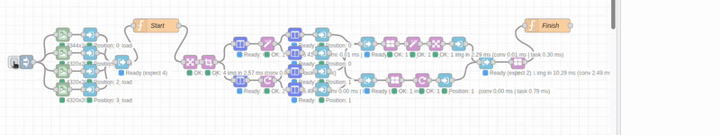

# Node-RED Image Processing Toolkit

A comprehensive Node-RED package providing 17 specialized nodes for high-performance image processing using C++ OpenCV backend. Perfect for computer vision workflows, batch processing, and automated image manipulation.



## 🚀 Quick Start

### Installation
```bash
# Quick setup
./install.sh

# Manual installation
cd rosepetal-image-engine && npm install && npm run build
cd ../node-red-contrib-rosepetal-image-tools && npm install
cd ~/.node-red && npm install /path/to/node-red-contrib-rosepetal-image-tools
```

### Requirements
- Node.js 16+ with node-gyp support
- OpenCV 4.x (auto-detected via pkg-config)
- C++ compiler with C++17 support

## 📋 Node Categories

### I/O Nodes - Data Flow Management
| Node | Purpose | Key Features |
|------|---------|-------------|
| **[image-in](docs/nodes/io/image-in.md)** | Load images from filesystem | JPEG/PNG/WebP/etc. support, Sharp backend |
| **[image-out](docs/nodes/io/image-out.md)** | Save images with timestamp naming | Auto-naming, overwrite protection, format conversion |
| **[array-in](docs/nodes/io/array-in.md)** | Collect data into positioned arrays | Dynamic positioning, batch collection |
| **[array-out](docs/nodes/io/array-out.md)** | Assemble arrays from multiple sources | Timeout protection, ordered assembly |
| **[array-select](docs/nodes/io/array-select.md)** | Extract elements with flexible selection | Python-like slicing, range selection |
| **[queue](docs/nodes/io/queue.md)** | Buffer and pace message delivery | FIFO gating, rate control, timed expiry |

### Transform Nodes - Image Processing
| Node | Purpose | Key Features |
|------|---------|-------------|
| **[resize](docs/nodes/transform/resize.md)** | Scale images with aspect ratio control | Proportional scaling, multiple modes |
| **[rotate](docs/nodes/transform/rotate.md)** | Rotate images with custom padding | Sub-pixel precision, background colors |
| **[crop](docs/nodes/transform/crop.md)** | Extract regions with pixel/normalized coords | Dynamic coordinates, bounds checking |
| **[padding](docs/nodes/transform/padding.md)** | Add configurable margins | Color customization, flexible sizing |
| **[filter](docs/nodes/transform/filter.md)** | Apply enhancement filters | Blur, sharpen, edge, emboss, Gaussian |
| **[draw](docs/nodes/transform/draw.md)** | Overlay points and lines on images | Normalized coordinates, typed inputs, C++ compositing |

### Mix Nodes - Image Composition
| Node | Purpose | Key Features |
|------|---------|-------------|
| **[concat](docs/nodes/mix/concat.md)** | Combine images horizontally/vertically | Direction control, padding strategies |
| **[mosaic](docs/nodes/mix/mosaic.md)** | Position images on canvas | Coordinate positioning, manual placement |
| **[advanced-mosaic](docs/nodes/mix/advanced-mosaic.md)** | Complex layouts with custom positioning | Pixel-perfect control, layering |

### Blend Nodes - Advanced Compositing  
| Node | Purpose | Key Features |
|------|---------|-------------|
| **[blend](docs/nodes/blend/blend.md)** | Alpha blend two images with opacity | Background removal, color tolerance |
| **[add-mask](docs/nodes/blend/add-mask.md)** | Apply polygon-based masks to regions | Coordinate arrays, mask strength control |

### Specialized Nodes - AI/ML Integration
| Node | Purpose | Key Features |
|------|---------|-------------|
| **[cropBB](docs/nodes/specialized/cropBB.md)** | Extract crops from AI bounding boxes | Object detection integration, confidence filtering |
| **[image-align](docs/nodes/specialized/image-align.md)** | Ultra-fast image alignment using ECC algorithm | Translation correction, speed presets, real-time processing |


## Architecture & Performance

### Two-Tier Design
- **JavaScript Layer**: Node-RED integration, validation, I/O handling
- **C++ Layer**: OpenCV-powered image processing for maximum performance

### Performance Benefits
- **Faster!** than pure JavaScript implementations
- **Parallel processing** for array operations
- **Memory efficient** with optimized algorithms
- **Async operations** with real-time performance timing

### Image Data Format
```javascript
{
  data: Buffer,        // Raw pixel data
  width: number,       // Image width in pixels  
  height: number,      // Image height in pixels
  channels: number,    // Channel count (1, 3, 4)
  colorSpace: string,  // "GRAY", "RGB", "RGBA", "BGR", "BGRA"
  dtype: string        // "uint8" (standard)
}
```

## 🛠️ Development

### Project Structure
```
node-red-contrib-rosepetal-image-tools/
├── docs/nodes/          # Individual node documentation
├── nodes/              # Node-RED node implementations
│   ├── io/             # I/O nodes
│   ├── transform/      # Transform nodes  
│   ├── mix/            # Composition nodes
│   ├── blend/          # Blending nodes
│   └── specialized/    # AI/ML nodes
├── lib/                # Shared utilities
└── assets/             # Documentation assets

rosepetal-image-engine/  # C++ processing engine
├── src/                # OpenCV implementations
├── binding.gyp         # Node.js addon configuration
└── package.json
```

### Adding New Nodes
1. Implement C++ processing in `rosepetal-image-engine/src/`
2. Export function in `src/main.cpp`
3. Create Node-RED wrapper in appropriate `nodes/` category
4. Add comprehensive documentation following existing patterns

## 🚨 Troubleshooting

### Common Issues
- **Build Failures**: Ensure OpenCV 4.x installed and pkg-config available
- **Missing Nodes**: Check Node-RED installation path and package registration  
- **Performance Issues**: Verify C++ addon built with optimization flags
- **Memory Problems**: Process large images in smaller batches

### Performance Tips
- Use **raw format** for processing chains (fastest)
- Process **arrays when possible** for parallel execution
- Choose **appropriate output formats** for your destination
- Monitor **node status displays** for timing information

## 🤝 Contributing

- **Issues**: Report bugs and feature requests via GitHub
- **Pull Requests**: Contributions welcome for new nodes and optimizations
- **Documentation**: Help improve guides and examples

## 📄 License

This project is part of the Rosepetal development toolkit for Node-RED image processing applications.

---

**💡 Pro Tip**: Start with simple single-node workflows, then combine them into complex processing pipelines as you become familiar with the image format and node interactions.
