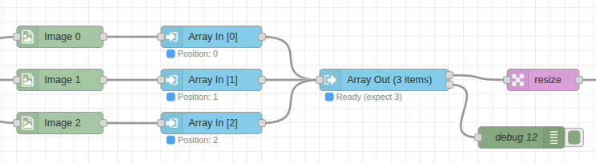

# Array-In Node

## Purpose & Use Cases

The `array-in` node collects data from various sources and tags it with position information for ordered array assembly. It works in partnership with the `array-out` node to create structured arrays from multiple parallel data streams.

**Real-World Applications:**
- **Batch Image Processing**: Collect multiple images for simultaneous processing
- **Data Aggregation**: Combine results from parallel processing pipelines
- **Multi-Source Analysis**: Merge data from different sensors or inputs
- **Synchronized Processing**: Ensure data maintains order through parallel workflows
- **Multi-Camera Systems**: Collect images from multiple cameras in correct sequence


*[PLACEHOLDER - Add GIF showing multiple data sources being collected into ordered positions]*

## Input/Output Specification

### Inputs
- **Input Message**: Message containing data at the configured input path
- **Dynamic Position**: Array position can be resolved from message properties

### Outputs
The node adds metadata to the message and sets payload for array assembly:

```javascript
{
  ...originalMessage,
  payload: any,           // The extracted data (same as meta.arrayData)
  meta: {
    arrayPosition: number,  // Index where this data belongs in array
    arrayData: any         // The extracted data from input path
  }
}
```

## Configuration Options

### Input From
- **Default**: `msg.payload`
- **Options**: 
  - `msg.*` - Read from message property
  - `flow.*` - Read from flow context
  - `global.*` - Read from global context
- **Purpose**: Specifies where to extract the data to be included in the array

### Array Position
- **Type**: Number or dynamic reference
- **Options**:
  - **Fixed Number**: Static position (0, 1, 2, ...)
  - **msg.***: Dynamic position from message property
  - **flow.***: Position from flow context
  - **global.***: Position from global context
- **Range**: Non-negative integers (0-based indexing)
- **Purpose**: Determines where this data appears in the final array

## Performance Notes

### Array Assembly Strategy
- **Position Tagging**: Lightweight metadata addition with minimal processing overhead
- **Memory Efficient**: Only stores references and position information
- **Parallel Collection**: Multiple array-in nodes can operate simultaneously
- **Order Preservation**: Maintains correct data sequence regardless of processing timing

### Status Display
- **Processing Info**: Shows array position and data type
- **Validation**: Indicates successful data extraction
- **Error Handling**: Displays warnings for missing data or invalid positions

## Real-World Examples

### Basic Multi-Image Collection
```
[Image-In: photo1.jpg] → [Array-In: pos=0] ┐
[Image-In: photo2.jpg] → [Array-In: pos=1] ├→ [Array-Out] → [Resize All]
[Image-In: photo3.jpg] → [Array-In: pos=2] ┘
```
Collect three images into an ordered array for batch processing.

### Dynamic Position Assignment
```
[Process Data] → [Set msg.index] → [Array-In: pos=msg.index] → [Array-Out]
```
Use dynamic positioning based on processing results.

### Mixed Data Sources
```
[msg.image1] → [Array-In: pos=0] ┐
[flow.image2] → [Array-In: pos=1] ├→ [Array-Out] → [Concat Images]
[global.image3] → [Array-In: pos=2] ┘
```
Combine data from different context levels.

### Conditional Assembly
```
[Switch] → [Array-In: pos=flow.nextIndex] → [Array-Out]
```
Dynamic array building based on conditions.

## Common Issues & Troubleshooting

### Position Conflicts
- **Issue**: Multiple nodes using same position
- **Solution**: Ensure each array-in node has unique position when feeding same array-out
- **Best Practice**: Use sequential positions starting from 0

### Missing Data
- **Issue**: Input path contains no data
- **Result**: `meta.arrayData` set to `null`
- **Solution**: Verify data exists at specified input path before processing

### Dynamic Position Errors
- **Issue**: Position resolves to non-integer or negative value
- **Solution**: Validate dynamic position sources return valid array indices
- **Check**: Use debug node to verify position values

### Array Gaps
- **Issue**: Non-sequential positions create sparse arrays
- **Result**: Array contains undefined elements at missing positions
- **Solution**: Use sequential positions or handle sparse arrays in downstream nodes

## Integration Patterns

### Standard Collection Pattern
```
[Data Source 1] → [Array-In: pos=0] ┐
[Data Source 2] → [Array-In: pos=1] ├→ [Array-Out] → [Process Array]
[Data Source N] → [Array-In: pos=N] ┘
```

### Dynamic Collection Pattern
```
[Split] → [Process] → [Array-In: pos=msg.index] → [Array-Out] → [Merge Results]
```

### Multi-Context Pattern
```
[msg Data] → [Array-In: pos=0] ┐
[flow Data] → [Array-In: pos=1] ├→ [Array-Out] → [Unified Processing]
[global Data] → [Array-In: pos=2] ┘
```

### Conditional Collection Pattern
```
[Data] → [Switch] → [Array-In: pos=flow.counter] → [Array-Out]
```

## Advanced Usage

### Sparse Arrays
- **Use Case**: Non-sequential positioning for specific data arrangement
- **Handling**: Downstream nodes must handle undefined elements
- **Example**: `[data0, undefined, data2, data3]`

### Dynamic Sizing
- **Pattern**: Use flow variables to track next available position
- **Implementation**: Increment flow.arrayIndex after each array-in operation
- **Benefit**: Flexible array building without predefined size

### Data Validation
- **Pre-Collection**: Validate data exists before array-in processing
- **Post-Collection**: Check array completeness in array-out node
- **Error Recovery**: Handle missing or invalid data gracefully