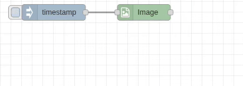

# Image-In Node

## Purpose & Use Cases

The `image-in` node is the primary entry point for loading images from the filesystem into Node-RED flows. It converts image files into the standardized image object format used throughout the Rosepetal Image Tools ecosystem.

**Real-World Applications:**
- **Photo Processing Workflows**: Load photos for batch editing and enhancement
- **Computer Vision Pipelines**: Import images for AI/ML analysis and object detection
- **Web Content Processing**: Load user-uploaded images for processing before storage
- **Surveillance Systems**: Import images from cameras or storage for analysis



## Input/Output Specification

### Inputs
- (any): Input message that triggers the node (content ignored)

### Outputs
The node outputs a standardized image object to the configured location:

```javascript
{
  data: Buffer,        // Raw pixel data  
  width: number,       // Image width in pixels
  height: number,      // Image height in pixels
  channels: number,    // Channel count (1, 3, 4)
  colorSpace: string,  // "GRAY", "RGB", "RGBA", ...
  dtype: string        // "uint8" (standard)
}
```

## Configuration Options

### File Path
- **Type**: String | msg | flow | global (required)
- **Description**: Path to the image file on the server filesystem
- **Options**:
  - **String**: Static absolute or relative path (e.g., `/home/user/photos/image.jpg`)
  - **msg.***: Dynamic path from message properties (e.g., `msg.imagePath`)
  - **flow.***: Dynamic path from flow context (e.g., `flow.currentImageFile`)
  - **global.***: Dynamic path from global context (e.g., `global.basePath`)
- **Supported Formats**: All formats supported by Sharp (JPEG, PNG, WebP, ...)

### Output Location
- **Default**: `msg.payload`
- **Options**: 
  - `msg.*` - Store in message property
  - `flow.*` - Store in flow context 
  - `global.*` - Store in global context
- **Use Case**: Choose based on how you want to access the image downstream

### Debug Options
- **Show Loaded Image**: Visual preview of loaded image in Node-RED editor
- **Debug Width**: Preview image width in pixels (default: 200)
- **Dynamic Width**: Can be resolved from msg, flow, or global context
- **Interactive**: Preview appears in Node-RED editor with timing information

## Performance Notes

### Sharp (libvips) Backend Optimization
- **High-Speed Loading**: Uses Sharp (libvips) for optimized image decoding
- **Async Processing**: Non-blocking operation with performance timing display
- **Memory Efficient**: Optimized for large images and batch processing
- **Metadata Extraction**: Complete image properties extracted during load

### Status Display
The node shows real-time progress and results:
- **Blue dot**: Reading file
- **Green dot**: Success with dimensions and timing info
- **Red ring**: Error with file access or format issues

## Real-World Examples

### Basic Photo Import
```
[Inject] → [Image-In: /photos/vacation.jpg] → [Debug]
```
Load a single photo and inspect its properties.

### Dynamic File Loading
```
[File List] → [Image-In: File Path from msg.imagePath] → [Resize] → [Save]
```
Process multiple files by configuring File Path to use `msg.imagePath` for dynamic file selection.

### Computer Vision Pipeline
```
[Image-In] → [CropBB] → [Filter] → [Analysis]
```
Load images for object detection and post-processing.

### Visual Development
```
[Image-In: Debug enabled] → [Transform] → [Output]
```
Enable debug preview to visually verify image loading and dimensions.

### Batch Processing Setup
```
[Image-In] → [Array-In] → [Array-Out] → [Batch Transform]
```
Collect multiple images into arrays for parallel processing.

## Common Issues & Troubleshooting

### File Access Problems
- **Issue**: "Cannot access file" warning
- **Solution**: Verify file path exists and Node-RED has read permissions
- **Check**: Use absolute paths to avoid relative path confusion

### Unsupported Format
- **Issue**: Node fails silently or errors
- **Solution**: Ensure file is in supported format (JPEG, PNG, WebP, BMP)
- **Check**: Verify file isn't corrupted using image viewer

### Memory Issues
- **Issue**: Large images cause performance problems
- **Solution**: Process images in batches, consider resizing after load
- **Optimization**: Use flow/global context for sharing large images

### Path Configuration
- **Static Path**: Set File Path to string type for fixed file locations
- **Dynamic Path**: Configure File Path from msg, flow, or global context for runtime file selection
- **Best Practice**: Validate dynamic path sources provide valid file paths

### Debug Display Issues
- **Issue**: Debug preview not appearing
- **Solution**: Ensure debug checkbox is enabled and Node-RED editor is active
- **Performance**: Large debug widths may impact editor performance
