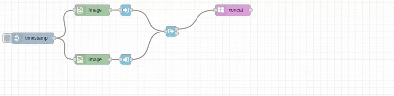

# Concat Node

## Purpose & Use Cases

The `concat` node combines multiple images horizontally or vertically into a single composite image. It automatically handles alignment and supports flexible input formats for creating image strips, panoramas, and comparison layouts.

**Real-World Applications:**
- **Before/After Comparisons**: Side-by-side image comparisons for treatments, edits, or changes
- **Product Catalogs**: Create product strips showing multiple views or variations
- **Social Media Content**: Combine multiple images for Instagram carousels or stories
- **Progress Documentation**: Show step-by-step processes or time-lapse sequences
- **Report Generation**: Combine charts, photos, and diagrams into unified layouts



## Input/Output Specification

### Inputs
- **Image Array**: Array of image objects to combine

### Outputs
- **Combined Image**: Single image containing all input images arranged in sequence
- **Expanded Dimensions**: Width or height increased to accommodate all images
- **Format Options**: Raw image object or encoded file formats

## Configuration Options

### Input/Output Paths
- **Input From**: `msg.payload` (default), `flow.*`, `global.*`
- **Output To**: `msg.payload` (default), `flow.*`, `global.*`

### Direction Options
- **Right**: Images arranged left-to-right horizontally (width increases)
- **Left**: Images arranged right-to-left horizontally (width increases)  
- **Down**: Images stacked top-to-bottom vertically (height increases)
- **Up**: Images stacked bottom-to-top vertically (height increases)

### Strategy Options

#### Padding Strategies (for dimension mismatches)
- **pad-start**: Add padding at beginning of smaller images
- **pad-end**: Add padding at end of smaller images
- **pad-both**: Center smaller images with padding on both sides
- **resize**: Resize all images to match largest dimension

### Color Configuration
- **Padding Color**: Background color for padding areas when images have different sizes
- **Default**: Black
- **Formats**: RGB (`rgb(255,0,0)`)

### Output Format Options
- **Raw**: Standard image object (fastest for processing chains)
- **JPEG**: Compressed with quality control
- **PNG**: Lossless with transparency support
- **WebP**: Modern format with excellent compression

## Performance Notes

### C++ Backend Processing
- **Optimized Composition**: Efficient memory allocation for composite canvas
- **Alignment Algorithms**: Fast positioning calculations for different alignment modes
- **Batch Processing**: All images processed in single operation
- **Memory Management**: Minimal copying with direct canvas placement

### Dimension Handling
- **Automatic Sizing**: Canvas automatically sized to fit all images
- **Alignment Compensation**: Background fill for dimension mismatches
- **Memory Efficiency**: Pre-calculates final dimensions to minimize allocations

## Real-World Examples

### Before/After Comparison
```
[Original Image] → [Array-In: pos=0] ┐
[Processed Image] → [Array-In: pos=1] ├→ [Array-Out] → [Concat: Direction=Right, Strategy=pad-both] → [Comparison Strip]
```
Create side-by-side before/after comparisons with centered alignment.

### Product Catalog Strip
```
[Product Photos Array] → [Concat: Direction=Right, Strategy=resize] → [Catalog Strip]
```
Combine multiple product views, resizing to uniform height.

### Progress Timeline
```
[Step 1 Image] → [Array-In: pos=0] ┐
[Step 2 Image] → [Array-In: pos=1] ├→ [Array-Out] → [Concat: Direction=Down, Strategy=pad-both] → [Process Timeline]
[Step 3 Image] → [Array-In: pos=2] ┘
```
Document multi-step processes vertically with centered alignment.

### Social Media Carousel
```
[Image Array] → [Resize: Same height] → [Concat: Direction=Right, Strategy=pad-start] → [Carousel Image]
```
Create horizontal image strips for social media.

### Report Layout
```
[Chart Image] → [Array-In: pos=0] ┐
[Photo Evidence] → [Array-In: pos=1] ├→ [Array-Out] → [Concat: Vertical] → [Report Section]
[Data Table] → [Array-In: pos=2] ┘
```
Combine different types of visual content into reports.

## Common Issues & Troubleshooting

### Dimension Mismatches
- **Issue**: Images with different sizes create alignment problems
- **Solution**: Use resize node to standardize dimensions before concat
- **Alternative**: Use appropriate alignment settings to handle size differences

### Memory Usage with Large Images
- **Issue**: Concatenating many large images uses significant memory
- **Solution**: Resize images to appropriate sizes before concatenation
- **Monitoring**: Watch memory usage with large image arrays

### Aspect Ratio Problems
- **Issue**: Combined image has awkward proportions
- **Planning**: Consider final aspect ratio when planning image arrangement
- **Solution**: Use padding or cropping to improve final composition

### Color Consistency
- **Issue**: Images have different color profiles or brightness
- **Preprocessing**: Apply consistent color correction before concatenation
- **Solution**: Use filter nodes to normalize appearance