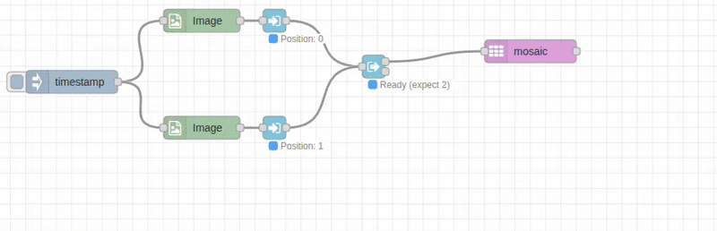

# Mosaic Node

## Purpose & Use Cases

The `mosaic` node provides manual positioning of multiple images on a canvas with precise coordinate control. It creates composite images by placing images at specific positions, supporting both normalized (0-1) and pixel coordinates for flexible layout creation.

**Real-World Applications:**
- **Custom Layouts**: Create precise image arrangements with exact positioning
- **Template-Based Designs**: Position images according to predefined layout templates  
- **Overlay Compositions**: Layer images at specific positions for complex compositions
- **Dashboard Assembly**: Position charts and data visualizations with pixel precision
- **Print Design**: Create exact layouts for brochures, posters, and marketing materials



## Input/Output Specification

### Inputs
- **Image Array**: Array of image objects to position on canvas
- **Position Configuration**: Position mappings defined in node configuration
- **Canvas Parameters**: Canvas dimensions and background settings

### Outputs
- **Composite Image**: Single image with positioned elements on canvas
- **Fixed Canvas Size**: Canvas dimensions as configured
- **Format Options**: Raw image object or encoded file formats

## Configuration Options

### Input/Output Paths
- **Input From**: `msg.payload` (default), `flow.*`, `global.*`
- **Output To**: `msg.payload` (default), `flow.*`, `global.*`

### Canvas Configuration

#### Canvas Dimensions
- **Canvas Width**: Width of output canvas in pixels
- **Canvas Height**: Height of output canvas in pixels
- **Sources**: Number, `msg.*`, `flow.*`, `global.*`

#### Background Settings
- **Background Color**: Color for empty canvas areas
- **Default**: Black 
- **Formats**: RGB (`rgb(255,0,0)`)

### Positioning System

#### Coordinate System
- **Normalized Mode**: Values from 0.0 to 1.0 (relative to canvas dimensions)
- **Pixel Mode**: Absolute pixel coordinates

#### Position Configuration
- **Position Mappings**: Array of position configurations in node editor
- **Array Index**: Which image from input array to position
- **X/Y Coordinates**: Position on canvas (normalized or pixel)
- **Per-Image Control**: Individual positioning for each image

### Output Format Options
- **Raw**: Standard image object (fastest for processing chains)
- **JPEG**: Compressed with quality control
- **PNG**: Lossless with transparency support
- **WebP**: Modern format with excellent compression

## Performance Notes

### C++ Backend Processing
- **Optimized Canvas Composition**: Efficient positioning and placement on fixed canvas
- **Memory Management**: Pre-allocated canvas with optimal memory usage
- **Batch Placement**: All images positioned in single C++ operation
- **Coordinate Validation**: Automatic bounds checking and position validation

### Position Processing
- **Coordinate Transformation**: Efficient conversion between normalized and pixel coordinates
- **Bounds Checking**: Automatic validation of positions within canvas boundaries  
- **Layer Management**: Proper handling of image placement order and overlaps

## Real-World Examples

### Custom Dashboard Layout
```javascript
// In function node: set specific positions for dashboard elements

  { arrayIndex: 0, x: 0, y: 0 }      // Chart at top-left
  { arrayIndex: 1, x: 400, y: 0 }    // KPI at top-right
  { arrayIndex: 2, x: 0, y: 300 }   // Graph at bottom-left  
  { arrayIndex: 3, x: 400, y: 300 }   // Table at bottom-right

```
```
[Dashboard Elements] → [Function: Set Positions] → [Mosaic: 800x600 canvas] → [Dashboard]
```

### Template-Based Layout
```javascript
// Predefined layout template positions

  { arrayIndex: 0, x: 0.1, y: 0.1 }   // Normalized coordinates
  { arrayIndex: 1, x: 0.6, y: 0.1 }    // 10% and 60% from left
  { arrayIndex: 2, x: 0.1, y: 0.6 }     // 10% and 60% from top

```
```
[Content Images] → [Function: Apply Template] → [Mosaic: Normalized coords] → [Layout]
```

### Overlay Composition
```
[Base Image] → [Array-In: pos=0] ┐
[Logo Overlay] → [Array-In: pos=1] ├→ [Function: Set Positions] → [Mosaic: Canvas] → [Branded Image]
[Text Overlay] → [Array-In: pos=2] ┘
```
Position logos and text overlays at specific coordinates.

### Print Layout Design
```javascript
// Precise positioning for print layout
canvasWidth = 1200;  // Print width
canvasHeight = 1800; // Print height
  { arrayIndex: 0, x: 100, y: 100 }   // Header image
  { arrayIndex: 1, x: 100, y: 400 }   // Content image
  { arrayIndex: 2, x: 100, y: 1200 }  // Footer image

```

## Common Issues & Troubleshooting

### Position Configuration Errors
- **Issue**: Images not appearing or positioned incorrectly
- **Solution**: Verify arrayIndex values match input array length
- **Validation**: Check that positions array contains valid coordinates

### Coordinate System Confusion  
- **Issue**: Images appearing in wrong locations
- **Solution**: Verify normalized vs. pixel coordinate mode matches your values
- **Normalized**: Use 0-1 values for relative positioning
- **Pixel**: Use absolute coordinates within canvas bounds

### Canvas Size Problems
- **Issue**: Images clipped or positioned outside visible area
- **Solution**: Ensure canvas dimensions accommodate all positioned images
- **Planning**: Calculate required canvas size based on image positions and sizes

### Position Array Mismatches
- **Issue**: ArrayIndex references non-existent images
- **Result**: Images ignored with warnings logged
- **Solution**: Validate arrayIndex values against input array length