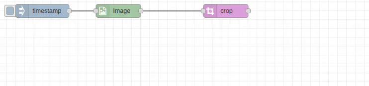

# Crop Node

## Purpose & Use Cases

The `crop` node extracts rectangular regions from images with support for both normalized coordinates (0-1) and pixel coordinates. It enables precise region selection for focus areas, object extraction, and image composition.

**Real-World Applications:**
- **Object Extraction**: Extract specific objects or regions of interest
- **Face Cropping**: Extract detected faces from photographs
- **Document Processing**: Extract text regions or signatures from scanned documents
- **Product Photography**: Extract product images from larger scenes
- **Art Composition**: Extract interesting portions of artwork or photography



## Input/Output Specification

### Inputs
- **Single Image**: Standard image object format
- **Image Array**: Array of image objects for batch cropping
- **Dynamic Coordinates**: Crop parameters can be provided via message properties

### Outputs
- **Cropped Image**: Extracted rectangular region as image object
- **Format Options**: Raw image object or encoded file formats (JPEG/PNG/WebP)

## Configuration Options

### Input/Output Paths
- **Input From**: `msg.payload` (default), `flow.*`, `global.*`
- **Output To**: `msg.payload` (default), `flow.*`, `global.*`

### Coordinate System
- **Normalized Coordinates**: Toggle between 0-1 range and pixel coordinates
- **Normalized Mode**: Values from 0.0 to 1.0 (relative to image dimensions)
- **Pixel Mode**: Absolute pixel coordinates

### Crop Parameters

#### X Position (cropX)
- **Normalized**: 0.0 (left edge) to 1.0 (right edge)
- **Pixel**: 0 to image width
- **Sources**: Number, `msg.*`, `flow.*`, `global.*`

#### Y Position (cropY)
- **Normalized**: 0.0 (top edge) to 1.0 (bottom edge)
- **Pixel**: 0 to image height
- **Sources**: Number, `msg.*`, `flow.*`, `global.*`

#### Width
- **Normalized**: 0.0 to 1.0 (proportion of image width)
- **Pixel**: Absolute width in pixels
- **Sources**: Number, `msg.*`, `flow.*`, `global.*`

#### Height
- **Normalized**: 0.0 to 1.0 (proportion of image height)
- **Pixel**: Absolute height in pixels
- **Sources**: Number, `msg.*`, `flow.*`, `global.*`

### Output Format Options
- **Raw**: Standard image object (fastest)
- **JPEG**: Compressed with quality control (1-100)
- **PNG**: Lossless compression with optional optimization
- **WebP**: Modern format with quality control

## Performance Notes

### C++ Backend Processing
- **High-Speed Extraction**: Optimized OpenCV-based region extraction
- **Memory Efficient**: Direct memory copy without full image processing
- **Bounds Checking**: Automatic coordinate validation and clipping
- **Parallel Processing**: Array inputs processed concurrently

### Coordinate Validation
- **Bounds Clipping**: Coordinates automatically clipped to image boundaries
- **Error Handling**: Invalid regions logged with graceful fallback
- **Status Display**: Processing time and result dimensions shown

## Real-World Examples

### Face Extraction (Normalized)
```
[Face Detection] → [Set msg.faceBox] → [Crop: X=msg.x, Y=msg.y, W=msg.w, H=msg.h] → [Face Image]
```
Extract detected faces using normalized coordinates from AI detection.

### Center Crop
```
[Image-In] → [Crop: X=0.25, Y=0.25, W=0.5, H=0.5] → [Center Square]
```
Extract the center 50% of any image.

### Document Region Extraction (Pixel)
```
[Scanned Document] → [Crop: X=100, Y=150, W=800, H=600] → [Text Region]
```
Extract specific document regions using pixel coordinates.

### Batch Product Extraction
```
[Product Photos] → [Array-Out] → [Crop: Normalized] → [Product Cutouts]
```
Extract product regions from multiple photos.

### Dynamic ROI Extraction
```
[Analysis] → [Set ROI Coords] → [Crop: Dynamic] → [Region of Interest]
```
Extract regions based on image analysis results.

## Common Issues & Troubleshooting

### Coordinate System Confusion
- **Issue**: Unexpected crop results
- **Solution**: Verify normalized vs pixel mode matches your coordinate system
- **Normalized**: Use 0-1 values for relative positioning
- **Pixel**: Use absolute coordinates

### Out of Bounds Cropping
- **Issue**: Crop region extends beyond image boundaries
- **Result**: Automatic clipping to image bounds with warning
- **Prevention**: Validate coordinates before processing

### Empty Crop Results
- **Issue**: Crop width or height is zero or negative
- **Result**: Warning logged, original image passed through
- **Solution**: Ensure width and height are positive values

### Dynamic Coordinate Errors
- **Issue**: Message properties don't contain valid coordinates
- **Solution**: Use debug nodes to verify coordinate values
- **Validation**: Check that dynamic sources provide numbers
