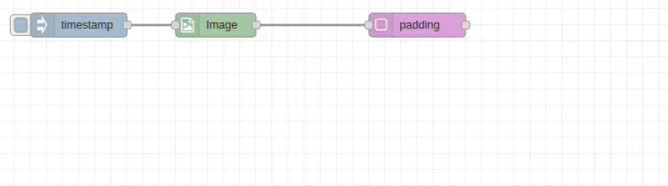

# Padding Node

## Purpose & Use Cases

The `padding` node adds margins around images with configurable colors and dimensions. It expands the canvas size while preserving the original image content, perfect for creating borders, standardizing dimensions, or preparing images for specific layouts.

**Real-World Applications:**
- **Social Media Formatting**: Add borders for consistent post dimensions
- **Print Preparation**: Add bleed areas and margins for professional printing
- **Gallery Display**: Create uniform frames for image collections  
- **Logo Branding**: Add branded borders around product images
- **Document Layout**: Add margins for text overlay or annotations


*[PLACEHOLDER - Add GIF showing various padding operations with different colors and dimensions]*

## Input/Output Specification

### Inputs
- **Single Image**: Standard image object format
- **Image Array**: Array of image objects for batch padding
- **Dynamic Values**: Padding dimensions can be provided via message properties

### Outputs
- **Padded Image**: Original image with added margins
- **Expanded Dimensions**: Canvas size increased by padding amounts
- **Format Options**: Raw image object or encoded file formats

## Configuration Options

### Input/Output Paths
- **Input From**: `msg.payload` (default), `flow.*`, `global.*`
- **Output To**: `msg.payload` (default), `flow.*`, `global.*`

### Padding Dimensions

#### Top Padding
- **Type**: Pixels (integer)
- **Sources**: Number, `msg.*`, `flow.*`, `global.*`
- **Effect**: Adds space above the image

#### Right Padding
- **Type**: Pixels (integer)  
- **Sources**: Number, `msg.*`, `flow.*`, `global.*`
- **Effect**: Adds space to the right of the image

#### Bottom Padding
- **Type**: Pixels (integer)
- **Sources**: Number, `msg.*`, `flow.*`, `global.*`
- **Effect**: Adds space below the image

#### Left Padding
- **Type**: Pixels (integer)
- **Sources**: Number, `msg.*`, `flow.*`, `global.*`
- **Effect**: Adds space to the left of the image

### Color Configuration

#### Padding Color
- **Formats Supported**:
  - Hex: `#FF0000` (red), `#FFFFFF` (white)
  - RGB: `rgb(255,0,0)`, `rgb(255,255,255)`
  - Named Colors: `red`, `white`, `black`, `blue`, `transparent`
- **Default**: Black (`#000000`)
- **Transparency**: Use `transparent` for PNG output with transparent padding

### Output Format Options
- **Raw**: Standard image object (fastest for processing chains)
- **JPEG**: Compressed (note: transparency becomes white)
- **PNG**: Lossless with full transparency support
- **WebP**: Modern format with transparency support

## Performance Notes

### C++ Backend Processing  
- **Efficient Canvas Expansion**: Optimized memory allocation for padded dimensions
- **Color Fill**: Fast uniform color filling using OpenCV
- **Memory Management**: Minimal memory overhead for padding operations
- **Batch Processing**: Array inputs processed in parallel

### Dimension Calculations
- **New Width**: Original width + left padding + right padding
- **New Height**: Original height + top padding + bottom padding
- **Position**: Original image positioned at (left_padding, top_padding)

## Real-World Examples

### Social Media Post Creation
```
[Image-In: product.jpg] → [Padding: 50px all sides, Brand color] → [Social Post]
```
Add branded borders for consistent social media appearance.

### Print Preparation  
```
[Photo] → [Padding: Top=100, Right=50, Bottom=100, Left=50, White] → [Print Ready]
```
Add margins for professional printing with bleed areas.

### Gallery Standardization
```
[Image Array] → [Padding: Equal margins, White] → [Uniform Gallery]
```
Create consistent framing for image galleries.

### Logo Watermarking Prep
```
[Product Image] → [Padding: Bottom=80, Transparent] → [Ready for Logo Overlay]
```
Add space for logo placement with transparent background.

### Document Border Creation
```
[Document Scan] → [Padding: 20px all sides, Light gray] → [Bordered Document]
```
Add subtle borders to scanned documents.

## Common Issues & Troubleshooting

### Transparency Issues
- **Issue**: Transparent padding appears white in JPEG
- **Solution**: Use PNG or WebP format for transparency support
- **Workaround**: Match padding color to expected background

### Large File Sizes
- **Issue**: Padding significantly increases file size
- **Cause**: Expanded canvas dimensions
- **Solution**: Use appropriate compression settings, consider if padding is necessary

### Color Matching Problems
- **Issue**: Padding color doesn't match expected appearance  
- **Solution**: Use exact color specifications (hex codes)
- **Testing**: Use debug mode to verify color appearance

### Dynamic Dimension Errors
- **Issue**: Invalid padding values from message properties
- **Solution**: Validate that dynamic sources contain positive integers
- **Safety**: Add bounds checking in upstream nodes

## Integration Patterns

### Social Media Pipeline
```
Image-In → Resize (Square) → Padding (Brand border) → JPEG → Upload
```
Standardize images for social media posting.

### Print Production
```
Image → Crop (Content) → Padding (Margins) → PNG → Print Queue
```
Prepare images for professional printing.

### Gallery Processing
```
Array-Out → Padding (Uniform) → Resize (Standard) → Gallery Display
```
Create consistent gallery layouts.

### Overlay Preparation
```
Base Image → Padding (Space for overlay) → Transparent PNG → Overlay Composite
```
Prepare base images for overlay composition.

## Advanced Usage

### Proportional Padding
```javascript
// In a function node before padding:
const paddingPercent = 0.1; // 10% padding
msg.paddingSize = Math.round(Math.max(msg.image.width, msg.image.height) * paddingPercent);

// Use msg.paddingSize for all padding dimensions
```

### Aspect Ratio Correction with Padding
```javascript
// Add padding to make image square
const width = msg.image.width;
const height = msg.image.height;

if (width > height) {
  const diff = width - height;
  msg.topPadding = Math.floor(diff / 2);
  msg.bottomPadding = Math.ceil(diff / 2);
  msg.leftPadding = 0;
  msg.rightPadding = 0;
} else if (height > width) {
  const diff = height - width;
  msg.leftPadding = Math.floor(diff / 2);
  msg.rightPadding = Math.ceil(diff / 2);
  msg.topPadding = 0;
  msg.bottomPadding = 0;
}
```

### Dynamic Color Selection
```javascript
// Select padding color based on image analysis
if (msg.imageType === 'photo') {
  msg.paddingColor = '#FFFFFF'; // White for photos
} else if (msg.imageType === 'graphic') {
  msg.paddingColor = 'transparent'; // Transparent for graphics
} else {
  msg.paddingColor = '#F5F5F5'; // Light gray for documents
}
```

## Best Practices

### Dimension Planning
- Consider final output dimensions when planning padding
- Use consistent padding across image sets for uniform appearance
- Account for padding in downstream processing size calculations

### Color Strategy
- Use white padding for photos and documents
- Use transparent padding for overlays and graphics (PNG required)
- Match brand colors for marketing materials
- Use subtle colors (light gray) for professional presentations

### Format Selection
- **PNG**: When transparency is needed
- **JPEG**: For photos with opaque padding (smaller files)
- **WebP**: Best compression with transparency support
- **Raw**: For continued processing chains

### Performance Optimization
- Use minimal padding necessary for your use case
- Process arrays when possible for batch efficiency
- Consider memory implications of significantly expanded dimensions
- Use appropriate output format based on final destination

### Quality Considerations
- Add padding early in processing chain to establish final dimensions
- Ensure padding color complements your content
- Test padding appearance in final display context
- Consider accessibility (contrast) when choosing padding colors