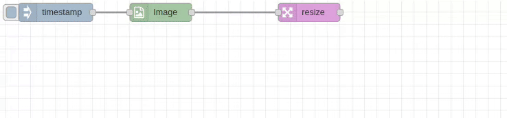

# Resize Node

## Purpose & Use Cases

The `resize` node provides high-performance image scaling with flexible dimension control and automatic aspect ratio preservation. It supports both fixed dimensions and proportional scaling using optimized C++ backend processing.

**Real-World Applications:**
- **Web Image Optimization**: Scale images for different device sizes and bandwidths
- **Thumbnail Generation**: Create preview images and gallery thumbnails
- **Print Preparation**: Resize images to specific print dimensions
- **Storage Optimization**: Reduce image sizes to save storage space
- **Performance Enhancement**: Optimize image sizes for faster loading



## Input/Output Specification

### Inputs
- **Single Image**: Standard image object format
- **Image Array**: Array of image objects for batch processing
- **Dynamic Dimensions**: Dimensions can be provided via message properties

### Input Image Format
```javascript
{
  data: Buffer,        // Raw pixel data
  width: number,       // Original width in pixels
  height: number,      // Original height in pixels
  channels: number,    // Channel count (1, 3, 4)
  colorSpace: string,  // "GRAY", "RGB", "RGBA"
  dtype: string        // "uint8"
}
```

### Outputs
Output format depends on the Output Format setting:
- **Raw**: Standard image object (fastest for processing chains)
- **JPEG/PNG/WebP**: Encoded file buffer ready for storage/transmission

## Configuration Options

### Input/Output Paths
- **Input From**: `msg.payload` (default), `flow.*`, `global.*`
- **Output To**: `msg.payload` (default), `flow.*`, `global.*`
- **Purpose**: Flexible data routing for complex workflows

### Dimension Configuration

#### Width Settings
- **Mode**:
  - **Set to**: Fixed pixel value (e.g., 800 pixels)
  - **Multiply by**: Scale factor (e.g., 0.5 for half size)
- **Value Sources**:
  - **Number**: Fixed value
  - **msg.***: Dynamic from message property
  - **flow.***: From flow context
  - **global.***: From global context
- **Auto Mode**: Leave empty for automatic aspect ratio preservation

#### Height Settings
- **Mode**: Same options as width (Set to / Multiply by)
- **Value Sources**: Same dynamic options as width
- **Auto Mode**: Leave empty for proportional scaling

### Output Format Options

#### Raw Format (Default)
- **Performance**: Fastest option for processing chains
- **Use Case**: When passing to other transform nodes

#### JPEG Format
- **Quality**: 1-100 (default: 90)
- **Use Case**: Final output, web optimization
- **Compression**: Lossy, smaller file sizes

#### PNG Format
- **Optimize**: Checkbox for additional compression
- **Use Case**: When transparency needed or lossless required
- **Compression**: Lossless

#### WebP Format
- **Quality**: 1-100 (default: 90)
- **Use Case**: Modern web applications
- **Compression**: Superior to JPEG at same quality

### Debug Options
- **Show Processed Image**: Visual preview in Node-RED editor
- **Debug Width**: Preview image width in pixels
- **Interactive**: Click preview to hide

## Performance Notes

### C++ Backend Optimization
- **High-Speed Processing**: OpenCV-based scaling algorithms
- **Memory Efficient**: Optimized memory management for large images
- **Parallel Processing**: Array inputs processed concurrently
- **Algorithm**: Uses high-quality interpolation for best results

### Processing Modes
- **Batch Processing**: Arrays processed in parallel for maximum throughput
- **Async Operations**: Non-blocking processing with timing display
- **Status Display**: Real-time processing time and result information

## Real-World Examples

### Web Image Optimization
```
[Image-In: original.jpg] → [Resize: 800x600] → [Save: web_optimized.jpg]
```
Create web-optimized versions of high-resolution images.

### Responsive Image Set
```
[Image-In] → [Resize: 1200x Auto] → [JPEG Quality 80] → [Large]
          → [Resize: 800x Auto]  → [JPEG Quality 85] → [Medium]
          → [Resize: 400x Auto]  → [JPEG Quality 90] → [Small]
```
Generate multiple sizes for responsive web design.

### Thumbnail Generation
```
[Image Array] → [Resize: 150x150] → [PNG] → [Thumbnail Gallery]
```
Create square thumbnails from image collections.

### Batch Photo Processing
```
[Photo Collection] → [Resize: Multiply 0.7] → [Save Reduced]
```
Reduce photo sizes by 30% for storage optimization.

### Dynamic Sizing
```
[Set msg.targetWidth] → [Resize: Set to msg.targetWidth, Auto height] → [Output]
```
Resize based on runtime requirements.

## Common Issues & Troubleshooting

### Aspect Ratio Distortion
- **Issue**: Images appear stretched or squashed
- **Cause**: Both width and height set without considering aspect ratio
- **Solution**: Leave one dimension empty for auto-calculation

### Memory Issues with Large Images
- **Issue**: Processing very large images causes performance problems
- **Solution**: Process in batches or reduce dimensions incrementally
- **Best Practice**: Consider source image size vs. target size

### Quality vs. File Size Balance
- **Issue**: Output files too large or quality too low
- **Solution**: Adjust quality settings (80-95 for good balance)
- **Format Choice**: Use WebP for best compression, PNG for transparency

### Dynamic Value Errors
- **Issue**: Runtime errors when using message properties
- **Solution**: Validate dynamic values exist and are valid numbers
- **Debugging**: Use debug nodes to verify property values
