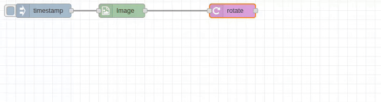

# Rotate Node

## Purpose & Use Cases

The `rotate` node provides precise image rotation with customizable padding and background colors. It supports both clockwise and counter-clockwise rotation with automatic canvas adjustment to prevent clipping.

**Real-World Applications:**
- **Photo Orientation**: Correct camera orientation issues
- **Document Processing**: Straighten scanned documents and receipts
- **Artistic Effects**: Create artistic compositions with angled elements
- **Quality Control**: Align products for consistent photography
- **Medical Imaging**: Orient medical scans for proper analysis



## Input/Output Specification

### Inputs
- **Single Image**: Standard image object format
- **Image Array**: Array of image objects for batch rotation
- **Dynamic Angles**: Rotation angle can be provided via message properties

### Outputs
- **Rotated Image**: Image rotated by specified angle with expanded canvas
- **Format Options**: Raw image object or encoded file formats

## Configuration Options

### Input/Output Paths
- **Input From**: `msg.payload` (default), `flow.*`, `global.*`
- **Output To**: `msg.payload` (default), `flow.*`, `global.*`

### Rotation Settings

#### Angle
- **Range**: 0-360 degrees (or negative for counter-clockwise)
- **Precision**: Floating-point precision (e.g., 15.5 degrees)
- **Sources**: Number, `msg.*`, `flow.*`, `global.*`
- **Direction**: Positive = clockwise, Negative = counter-clockwise

#### Padding Settings
- **Background Color**: Color to fill expanded canvas areas
- **Color Formats**: 
  - Hex: `#FF0000` (red)
  - RGB: `rgb(255,0,0)`
  - Named: `red`, `white`, `black`, `transparent`
- **Default**: Black background

### Output Format Options
- **Raw**: Standard image object (fastest for processing chains)
- **JPEG**: Compressed with quality control (1-100)
- **PNG**: Lossless with transparency support
- **WebP**: Modern format with quality control

## Performance Notes

### C++ Backend Processing
- **High-Quality Rotation**: Uses OpenCV's optimized rotation algorithms
- **Canvas Expansion**: Automatic canvas sizing to prevent clipping
- **Memory Management**: Efficient handling of rotated image dimensions
- **Interpolation**: High-quality pixel interpolation for smooth results

### Processing Characteristics
- **Canvas Growth**: Output image may be larger than input to accommodate rotation
- **Edge Handling**: Configurable background fill for exposed areas
- **Precision**: Sub-pixel accuracy for precise angle control

## Real-World Examples

### Photo Orientation Correction
```
[Image-In: rotated_photo.jpg] → [Rotate: -90°] → [Corrected Photo]
```
Fix photos taken with rotated camera orientation.

### Document Straightening
```
[Scanned Document] → [Rotate: 2.3°, White background] → [Straight Document]
```
Correct slight rotation in scanned documents.

### Batch Photo Processing
```
[Photo Array] → [Rotate: msg.orientation] → [Corrected Photos]
```
Apply different rotation angles based on EXIF data.

### Artistic Composition
```
[Logo Image] → [Rotate: 45°, Transparent background] → [Diamond Logo]
```
Create artistic rotated elements with transparency.

### Dynamic Rotation
```
[Analysis] → [Calculate Angle] → [Rotate: msg.correctionAngle] → [Aligned Image]
```
Rotate based on image analysis results.

## Common Issues & Troubleshooting

### Image Size Changes
- **Issue**: Output image larger than input
- **Cause**: Canvas expansion to accommodate rotated content
- **Expected**: Normal behavior to prevent clipping
- **Solution**: Consider downstream processing for size constraints

### Background Color Issues
- **Issue**: Unexpected background colors in rotated areas
- **Solution**: Specify appropriate background color for your use case
- **Transparency**: Use PNG format with transparent background for overlays

### Performance with Large Angles
- **Issue**: Significant rotation (close to 45°, 135°, etc.) creates much larger images
- **Optimization**: Consider if rotation is necessary or can be minimized
- **Memory**: Monitor memory usage with very large images

### Precision vs. Speed
- **Issue**: High-precision angles may be slower
- **Balance**: Use appropriate precision for your requirements
- **Optimization**: Round to nearest degree if precision not critical
